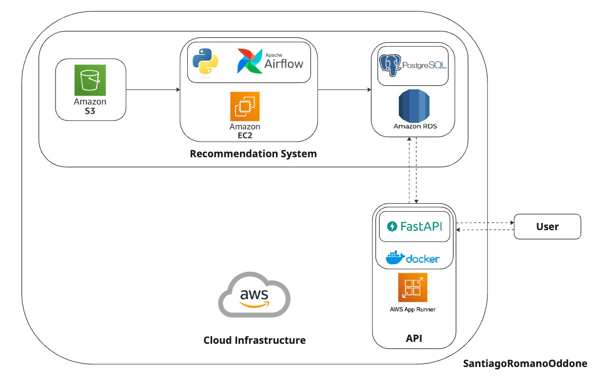

# AdTech




**AdTech** is a system designed to generate product recommendations for advertisers based on user interaction data. The project processes two types of input logs:

1. **Product View Logs**  
   Each entry represents a user viewing a product on an advertiser's website. These logs include:
   - Advertiser ID  
   - Product ID  
   - Date of the view  

2. **Ad Interaction Logs**  
   Each entry represents a user interacting with an ad on any website. These logs include:
   - Advertiser ID  
   - Product ID  
   - Type of interaction (impression or click)  
   - Date of the interaction  

Using this data, the system calculates two types of recommendations:  

- **Top Products**: Recommends the most viewed products on the advertiser's website.  
- **Top CTR Products**: Recommends products with the best ad performance, measured by Click-Through-Rate (CTR).  

### System Architecture

The entire system is hosted on AWS and uses an Airflow pipeline to generate daily product recommendations for each advertiser. The recommendations are stored in a PostgreSQL database on the RDS service. An API is provided to query product recommendations by advertiser, model, or date. The pipeline runs daily to update the recommendations, which can then be accessed through the API.

### Key Features

- **Daily Recommendations**: Generates daily product recommendations for each advertiser.
- **API Access**: Provides endpoints to query product recommendations and interact with the data.
- **AWS Integration**: Utilizes AWS services for hosting, data processing, and storage.

The system ensures up-to-date recommendations, making it easy to dynamically retrieve insights and drive advertising decisions.

# Project Setup Instructions

## Initial Setup

Follow these steps to set up the project environment for the first time:

1. **Clone the repository**:

    ```sh
    git clone <repository_url>
    cd <repository_directory>
    ```

2. **Create the conda environment**:

    ```sh
    conda create --name AdTech python=3.9
    ```

3. **Activate the environment**:

    ```sh
    conda activate AdTech
    ```

4. **Install the packages from `requirements.txt`**:

    ```sh
    pip install -r requirements.txt
    ```
